<p align="center">
  
</p>

<p align="center">
  
</p>

<p align="center">
  <a href="https://www.linkedin.com/in/harsh-lakkad/"></a>
  <a href="https://github.com/Harry3158?tab=repositories"></a>
  
</p>

---

## 🧑‍🚀 Crew Profile

```yaml
callsign:     Harsh Lakkad   # @Harry3158
base:         Germany 🇩🇪
specialty:    Space systems · engineering computation · automation
flight_code:  [Python, MATLAB, C, C++]
current_op:   Exploring spacecraft simulation with the Basilisk framework
mission:      Turn engineering problems into working code
```

> 🛰️ Engineer with a passion for space exploration. I use Python, MATLAB and C/C++ for
> spacecraft simulation, data-driven models and small tools that automate everyday work.

---

## 🛸 Spacecraft Fleet: Projects

<table>
<tr>
<td width="50%" valign="top">

### 🛰️ Basilisk: Spacecraft Simulation
`📅 Jul 2024` · `🏷️ Exploring`

Working with **Basilisk**, the open-source astrodynamics framework from AVS Lab (CU Boulder), for spacecraft
dynamics, attitude control and mission scenarios.

- ⚙️ **Systems:** C/C++ core · Python scenarios · Conan
- 🔬 **Focus:** Dynamics effectors, GN&C simulation

[🔗 View fork](https://github.com/Harry3158/basilisk)

</td>
<td width="50%" valign="top">

### 🌕 Pragyaan Rover: Auto-Generated Briefing
`📅 Jun 2024` · `🏷️ Complete`

A Python script that builds a complete PowerPoint briefing on ISRO's **Pragyaan** lunar rover: specs,
payloads (APXS, LIBS), mission objectives and landing.

- ⚙️ **Systems:** Python · python-pptx

[🔗 Source](https://github.com/Harry3158/harry-s-code/blob/main/harsh.py)

</td>
</tr>
<tr>
<td width="50%" valign="top">

### 🚗 Car Price Predictor: ML Web App
`📅 Jun 2024` · `🏷️ Complete`

A Flask web app that predicts used-car prices from the company, model, year, fuel type and kilometres
driven, using a trained machine-learning model.

- ⚙️ **Systems:** Python · Flask · pandas · NumPy · ML model

[🔗 Source](https://github.com/Harry3158/harry-s-code)

</td>
<td width="50%" valign="top">

### 📡 Video Downlink Tool
`📅 Jun 2024` · `🏷️ Complete`

A command-line tool that downloads YouTube videos at a chosen resolution and falls back automatically to
the best available stream.

- ⚙️ **Systems:** Python · pytube

[🔗 Source](https://github.com/Harry3158/harry-s-code)

</td>
</tr>
</table>

---

## 🔧 Propulsion Systems: Tech Stack

**Flight Software**
<p>
  
  
  
  
</p>

**Data & Simulation**
<p>
  
  
  
  
</p>

**Ground Control**
<p>
  
  
  
</p>

---

## 📊 Telemetry

<p align="center">
  
  
</p>
<p align="center">
  
</p>
<p align="center">
  
</p>

---

## 📻 Open Transmission

<p align="center">
  <i>"The sky is not the limit. It's just the beginning."</i><br/><br/>
  Open to collaborating on space systems, simulation and engineering software.
  <a href="https://www.linkedin.com/in/harsh-lakkad/">Send a signal on LinkedIn</a> 🛰️
  <br/><br/>
  
</p>
