  

  
  
  

 

### Hi, I'm Harsh Lakkad

I'm an engineer based in Germany, interested in **space systems, spacecraft simulation and engineering software**. I mainly use **Python, MATLAB and C/C++** to model physical systems, analyse data, and build tools that turn routine engineering work into automated, repeatable workflows.

Right now I'm working with **Basilisk**, the open-source astrodynamics framework from the Autonomous Vehicle Systems (AVS) Lab at CU Boulder. I use it to study spacecraft dynamics, attitude control and how mission scenarios are simulated end to end.

 

| Subsystem | Scope |
|:--|:--|
| **Spacecraft Simulation** | Astrodynamics and GN&C scenarios with Basilisk (C/C++ core, Python scenario scripting) |
| **Engineering Computation** | Modelling, numerical analysis and visualisation in Python (NumPy, pandas, Matplotlib) and MATLAB |
| **Automation & Tooling** | Scripts that generate technical documents and presentations, plus command-line utilities |
| **Applied ML & Web** | Serving trained models through lightweight Flask web interfaces |

  
  
  
  
  
  
  
  

 

| Project | Description | Stack | Date |
|:--|:--|:--|:--:|
| [**Basilisk Spacecraft Simulation**](https://github.com/Harry3158/basilisk) | Hands-on work with the AVS Lab astrodynamics framework, covering dynamics effectors, attitude control and mission-scenario simulation | C/C++ · Python | `Jul 2024` |
| [**Pragyaan Rover Briefing Generator**](https://github.com/Harry3158/harry-s-code/blob/main/harsh.py) | A script that builds a complete PowerPoint briefing on ISRO's Pragyaan lunar rover, covering specifications, APXS and LIBS payloads, mission objectives and landing | Python · python-pptx | `Jun 2024` |
| [**Car Price Predictor**](https://github.com/Harry3158/harry-s-code) | A Flask web app that predicts used-car prices from manufacturer, model, year, fuel type and distance driven, using a trained ML model | Python · Flask · pandas | `Jun 2024` |
| [**Video Downlink Utility**](https://github.com/Harry3158/harry-s-code) | A command-line tool that downloads YouTube videos at a chosen resolution and falls back automatically to the best available stream | Python · pytube | `Jun 2024` |

 

- 🛰️ Exploring **spacecraft dynamics and attitude control** through Basilisk simulation scenarios
- 📐 Building engineering computation skills in **Python and MATLAB**
- 🤝 Open to **roles, internships and collaborations** in space systems and engineering software

 

- **LinkedIn:** [linkedin.com/in/harsh-lakkad](https://www.linkedin.com/in/harsh-lakkad/)
- **GitHub:** [github.com/Harry3158](https://github.com/Harry3158)

 

  

